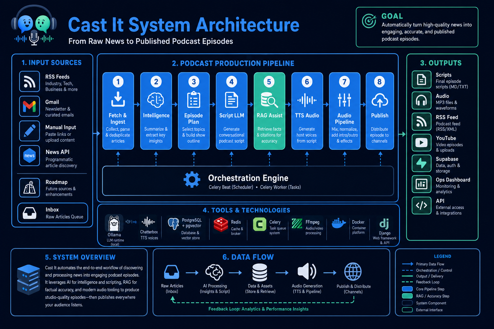

# Cast It — AI Podcast Generator


Cast It is a Django-based AI podcast production platform for news ingestion, article intelligence, multi-stage LLM script generation, TTS audio synthesis, FFmpeg post-processing, and multi-channel publishing (RSS / YouTube / Supabase).


---

## Architecture and Features



### Tech Stack

- Django 5, PostgreSQL 16, pgvector
- RAG, Prompt engineering, Context engineering
- Ollama (chat script generation, embeddings)
- Celery + Redis (ingestion, LLM, TTS, audio, publishing)
- Chatterbox TTS + FFmpeg
- Docker Compose, Nginx (staging / production)

### Core Features

- Operations Dashboard
  - Monitors pipeline health, content sources, scripts, and per-episode stage progress.
  - Separate from Django Admin; shared staff login at `/accounts/login/`.

- News Ingestion & Article Intelligence
  - Imports articles from RSS / newsletter providers.
  - Summarizes, classifies, tags (fixed taxonomy), ranks, and selects script sources.

- Multi-Stage Script Generation (LLM)
  - Manual Generate Script from `/content/` (not Celery Beat).
  - Pipeline: story brief → episode outline → chapter dialogue → critic/rewrite → coherence.
  - Optional article RAG via pgvector when source text exceeds the token budget.

- Audio Generation & Pipeline
  - Chatterbox TTS with intro / expert / beginner voice roles.
  - FFmpeg concat, silence, optional intro/outro/BGM, loudness normalization.

- Publishing
  - RSS feed generation, optional YouTube adapter.
  - Supabase “listener shelf” push for the public frontend (local factory → cloud shelf).

- Jobs, Workflow & Observability
  - Trackable Celery jobs with retry / cancel.
  - Structured JSON logs, metrics, tracing, health probes.

### Project Structure

```text
cast-it-podcast-builder/
├── api/                    # REST API (v1)
├── apps/                   # Django apps (models, admin, ops UI)
│   ├── articles/
│   ├── audio/
│   ├── episodes/
│   ├── knowledge/
│   ├── operations/         # Dashboard / content / pipeline UI
│   ├── providers/
│   ├── publish/
│   ├── scheduler/
│   ├── scripts/
│   └── ...
├── config/                 # Django settings + Celery
├── domain/                 # DTOs, enums, exceptions, schemas
├── infrastructure/         # LLM, TTS, vector store, deployment adapters
├── services/               # Business logic (scripts, knowledge, publish, …)
├── templates/prompts/      # LLM prompt templates
├── docker/                 # Dockerfile, entrypoint, Nginx, Gunicorn
├── scripts/                # start/stop, admin, auth helpers
├── supabase/               # Listener DB migrations
├── tests/
├── img/                    # Brand assets / architecture diagram
├── docker-compose.yml
├── requirements/
│   ├── base.txt
│   └── dev.txt
└── manage.py
```


## Table of Instructions

1. [Prerequisites](#prerequisites)
2. [Installation from Scratch](#installation-from-scratch)
3. [Environment Variables](#environment-variables)
4. [Database Migration](#database-migration)
5. [Management Commands Reference](#management-commands-reference)
6. [Recommended First-Run Pipeline](#recommended-first-run-pipeline)
7. [Docker and Daily Development Commands](#docker-and-daily-development-commands)
8. [Built-in Django Commands](#built-in-django-commands)
9. [Ollama Setup](#ollama-setup)
10. [Chatterbox TTS Setup](#chatterbox-tts-setup)
11. [Celery Background Tasks](#celery-background-tasks)
12. [Post-Install Verification](#post-install-verification)
13. [Testing](#testing)
14. [Operations Dashboard](#operations-dashboard)
15. [Listener Distribution (Supabase)](#listener-distribution-supabase)
16. [API Overview](#api-overview)

---

## Prerequisites

| Item | Version / Notes |
|------|-----------------|
| Git | Any recent version |
| Docker | 20.10+ |
| Docker Compose | v2 (`docker compose` subcommand) |
| Disk space | 5 GB+ recommended (Postgres volume, media, models) |
| Ollama (optional) | Host install for script generation + embeddings; CRUD / RSS import work without it |
| Chatterbox (optional) | Host TTS server for audio generation |
| FFmpeg | Included in Docker images; needed on host for non-Docker audio runs |

Verify Docker is available:

```bash
docker info
docker compose version
```

---

## Installation from Scratch

The steps below assume you are in the **project root** (contains `docker-compose.yml` and `manage.py`).

### Step 1: Clone the repository

```bash
git clone git@github.com:wenyenhsu/cast-it-podcast-builder.git
cd cast-it-podcast-builder
```

### Step 2: Create the environment file

```bash
cp .env.example .env
```

Edit `.env` as needed (see [Environment Variables](#environment-variables)). At minimum set:

```bash
DJANGO_SECRET_KEY=your-secret-key-here
WEB_PORT=8000
OLLAMA_CHAT_MODEL=gemma3:12b
OLLAMA_EMBED_MODEL=nomic-embed-text:latest
```

> Never commit `.env` files containing real secrets.

### Step 3: Build and start all services

```bash
./scripts/start.sh
```

Or manually:

```bash
docker compose build
docker compose up -d
```

This starts:

| Service | Purpose | Exposed port |
|---------|---------|--------------|
| `web` | Django (runs `migrate` on startup) | `WEB_PORT` (default random / `8000`) |
| `db` | PostgreSQL 16 + pgvector | internal only |
| `redis` | Celery broker / cache | internal only |
| `celery-worker` | Background tasks | — |
| `celery-beat` | Scheduler | — |

`db` and `redis` are **not** published to the host by default (avoids conflicts with local Postgres/Redis). Use `docker-compose.host-access.yml` when you need host ports.

Check container status:

```bash
docker compose ps
```

On success, `./scripts/start.sh` prints URLs similar to:

```text
Cast It is running.

  API base:   http://localhost:8000/api/v1/
  Health:     http://localhost:8000/api/v1/health/live/
  API docs:   http://localhost:8000/api/v1/docs/
  Dashboard:  http://localhost:8000/
  Admin:      http://localhost:8000/admin/
```

### Step 4: Confirm migrations are applied

The `web` container runs migrations on startup via `docker/entrypoint.sh`. Verify:

```bash
docker compose exec web python manage.py showmigrations
```

If any migration shows `[ ]`, run:

```bash
docker compose exec web python manage.py migrate
```

### Step 5: Create an admin / staff user

```bash
docker compose exec web python manage.py createsuperuser
```

Or:

```bash
USE_DOCKER=true ./scripts/create-admin.sh
```

### Step 6: (Optional) Install Ollama on the host and pull models

Run on the **host machine** (not inside the container):

```bash
# Install Ollama: https://ollama.com
ollama pull gemma3:12b
ollama pull nomic-embed-text
```

Containers reach host Ollama at `http://host.docker.internal:11434` by default.

### Step 7: (Optional) Start Chatterbox TTS on the host

Point `CHATTERBOX_BASE_URL` at your Chatterbox server (default `http://host.docker.internal:8004`).

### Step 8: Validate config and open the UI

```bash
docker compose exec web python manage.py validate_config --warn-only
```

| Page | URL |
|------|-----|
| Operations Dashboard | http://localhost:8000/ |
| Django Admin | http://localhost:8000/admin/ |
| API docs | http://localhost:8000/api/v1/docs/ |

Basic installation is complete.

---

## Environment Variables

`.env.example` highlights (see the file for the full list):

```env
DJANGO_SETTINGS_MODULE=config.settings.development
DJANGO_SECRET_KEY=change-me-in-production
DJANGO_DEBUG=True
DJANGO_ALLOWED_HOSTS=localhost,127.0.0.1
TIME_ZONE=America/Los_Angeles

POSTGRES_DB=cast_it
POSTGRES_USER=cast_it
POSTGRES_PASSWORD=cast_it
POSTGRES_HOST=localhost          # overridden to `db` inside Compose
POSTGRES_PORT=5432

REDIS_URL=redis://localhost:6379/0
WEB_PORT=8000

LLM_PROVIDER=ollama
OLLAMA_BASE_URL=http://host.docker.internal:11434
OLLAMA_CHAT_MODEL=gemma3:12b
OLLAMA_EMBED_MODEL=nomic-embed-text:latest
LLM_TEMPERATURE=0.3
OLLAMA_NUM_CTX=16384
LLM_TIMEOUT=60

RAG_ENABLED=true
RAG_TOP_K=10
RAG_VECTOR_STORE=pgvector

TTS_PROVIDER=chatterbox
CHATTERBOX_BASE_URL=http://host.docker.internal:8004
```

| Variable | Default | Description |
|----------|---------|-------------|
| `WEB_PORT` | `0` / unset = random | Host port for Django web |
| `LLM_TIMEOUT` | `60` | LLM HTTP timeout (seconds); raise for long script runs |
| `SCRIPT_SOURCE_MAX_TOKENS` | `3500` | Per-article source budget before RAG kicks in |
| `SCRIPT_POST_COHERENCE_CRITIC` | `false` | Extra critic loop after coherence (more LLM calls) |
| `RAG_ENABLED` | `true` | Enable pgvector RAG for script enrichment |
| `BEAT_IMPORT_NEWS_CRON` | `0 6 * * *` | Daily news import |
| `BEAT_EPISODE_PLANNING_CRON` | `0 7 * * *` | Daily episode planning |
| `BEAT_GENERATE_AUDIO_CRON` | `0 9 * * *` | Daily audio generation |
| `BEAT_PUBLISH_EPISODE_CRON` | `0 10 * * *` | Daily publish |
| `BEAT_PUBLISH_SUPABASE_CRON` | `25 7 * * *` | Supabase shelf sync |
| `BEAT_RETRY_SWEEP_CRON` | `*/30 * * * *` | Retry failed jobs |
| `BEAT_HEALTH_CHECK_CRON` | `*/15 * * * *` | Provider health check |
| `SUPABASE_URL` / `SUPABASE_SERVICE_ROLE_KEY` | empty | Required for listener shelf publishing |
| `ENABLE_RSS_PUBLISHING` | `true` | Write local RSS feed |
| `ENABLE_YOUTUBE_PUBLISHING` | `false` | YouTube adapter |

Script generation is **manual** from `/content/` — there is no Beat schedule for it.

---

## Database Migration

### Overview

- Migration files live in `apps/<app>/migrations/`.
- **Fresh database**: run `migrate` only; no `makemigrations` unless you change models.
- **After pulling new code**: run `showmigrations`, then `migrate`.

### First-time install

```bash
docker compose exec web python manage.py showmigrations
docker compose exec web python manage.py migrate
docker compose exec web python manage.py showmigrations
```

### After changing models (developers)

```bash
docker compose exec web python manage.py makemigrations
docker compose exec web python manage.py migrate
```

### Common migration errors

| Error | Cause | Fix |
|-------|-------|-----|
| `relation "xxx" does not exist` | DB not migrated | `python manage.py migrate` |
| Migration conflict | Concurrent model changes | Merge migrations or reset dev DB volume |

Reset the development database (**deletes all data**):

```bash
docker compose down -v
docker compose up -d
docker compose exec web python manage.py migrate
docker compose exec web python manage.py createsuperuser
```

---

## Management Commands Reference

> **Docker command prefix**  
> From the project root:  
> `docker compose exec web python manage.py <command> [options]`

Custom commands:

### `validate_config`

Validates environment variables for the current deployment target.

```bash
docker compose exec web python manage.py validate_config
docker compose exec web python manage.py validate_config --warn-only
docker compose exec web python manage.py validate_config --environment production
```

| Option | Description |
|--------|-------------|
| `--environment` | Override `ENVIRONMENT` for validation |
| `--warn-only` | Print warnings without failing |

**When to run**: After editing `.env`, before staging/prod deploys.

---

### `bootstrap_voices`

Creates or repairs intro / expert / beginner voice mappings for Chatterbox TTS.

```bash
docker compose exec web python manage.py bootstrap_voices
```

**When to run**: After configuring Chatterbox voices, or when TTS roles are missing.

---

### `publish_supabase`

Uploads final episode audio + metadata to Supabase (listener shelf). Also syncs the tag taxonomy.

```bash
# All publishable episodes
docker compose exec web python manage.py publish_supabase

# Single episode
docker compose exec web python manage.py publish_supabase --episode-id <uuid>
```

| Option | Description |
|--------|-------------|
| `--episode-id <uuid>` | Publish one episode only |

**Prerequisites**: `SUPABASE_URL`, `SUPABASE_SERVICE_ROLE_KEY`, final audio on the episode.

---

### `prune_script_schedule`

Removes leftover automatic script-generation Beat entries (script gen is manual-only).

```bash
docker compose exec web python manage.py prune_script_schedule
```

---

## Recommended First-Run Pipeline

For a **full-featured** local smoke test (import → plan → script → audio → publish):

```bash
# 0. Stack + admin
./scripts/start.sh
docker compose exec web python manage.py createsuperuser
docker compose exec web python manage.py validate_config --warn-only

# 1. Host AI services
ollama pull gemma3:12b
ollama pull nomic-embed-text
# Start Chatterbox on the host if you need TTS

# 2. In Operations Dashboard (/)
#    - Providers → add an RSS news source
#    - Content → import / select articles for script
#    - Content → Generate Script (manual)
#    - Pipeline → confirm stage durations
#    - TTS / audio when ready

# 3. Optional: push to listener shelf
make publish-supabase
```

Makefile shortcuts for scheduled pipeline steps (via Celery task entrypoints):

```bash
make import-news
make plan-episode
make generate-audio
make publish
```

For **CRUD / dashboard only** (no AI), steps 0 + staff user are enough.

---

## Docker and Daily Development Commands

```bash
# Preferred local start / stop
./scripts/start.sh
./scripts/stop.sh

# Or Makefile
make up
make down
make build
make rebuild
make restart

# Logs
make logs
make logs-web
make logs-worker
make logs-beat

# Django helpers
make shell
make bash
make migrate
make createsuperuser

# DB / Redis
make db-shell
make redis-cli

# Expose db/redis on the host (for local pytest / psql)
docker compose -f docker-compose.yml -f docker-compose.host-access.yml up -d db redis
export POSTGRES_PORT="$(docker compose port db 5432 | cut -d: -f2)"
```

Compose files:

| File | Purpose |
|------|---------|
| `docker-compose.yml` | Local development (default) |
| `docker-compose.host-access.yml` | Optional host ports for db / redis |
| `docker/deploy/` | Staging / production stacks (see `docker/deploy/README.md`) |

---

## Built-in Django Commands

All use the `docker compose exec web python manage.py` prefix.

| Command | Purpose |
|---------|---------|
| `check` | Validate Django settings |
| `shell` / `shell_plus` | Django ORM shell |
| `dbshell` | Database CLI |
| `createsuperuser` | Create admin user |
| `changepassword <username>` | Reset password |
| `showmigrations` | Migration status |
| `makemigrations` | Generate migrations |
| `migrate` | Apply migrations |
| `collectstatic` | Collect static files |
| `test` | Django test runner |
| `clearsessions` | Remove expired sessions |

Examples:

```bash
docker compose exec web python manage.py check
docker compose exec web python manage.py shell
docker compose exec web python manage.py collectstatic --noinput
```

---

## Ollama Setup

1. Install and start Ollama on the host.
2. Pull models:

```bash
ollama pull gemma3:12b
ollama pull nomic-embed-text
```

3. Verify the API on the host:

```bash
curl http://localhost:11434/api/tags
```

4. Default URL inside Docker: `OLLAMA_BASE_URL=http://host.docker.internal:11434`  
   On Linux, if `host.docker.internal` fails, set the host IP in `.env`.

Features that depend on Ollama:

- Article summarize / classify / rank
- Multi-stage script generation
- Embeddings for RAG indexing / retrieval

**RAG note:** When `RAG_ENABLED=true`, articles are indexed into pgvector. During script generation, per-article RAG context is assembled only if cleaned source text exceeds `SCRIPT_SOURCE_MAX_TOKENS`; otherwise the model uses the truncated article source directly.

---

## Chatterbox TTS Setup

1. Run your local Chatterbox TTS server on the host (see the `Chatterbox-TTS-Server/` folder if present, or your own install).
2. Ensure voices exist for intro / expert / beginner roles (or leave defaults empty to auto-pick).
3. Set in `.env`:

```env
TTS_PROVIDER=chatterbox
CHATTERBOX_BASE_URL=http://host.docker.internal:8004
CHATTERBOX_DEFAULT_VOICE=
CHATTERBOX_VOICE_INTRO=
CHATTERBOX_VOICE_EXPERT=
CHATTERBOX_VOICE_BEGINNER=
```

4. Bootstrap voice mappings if needed:

```bash
docker compose exec web python manage.py bootstrap_voices
```

On Apple Silicon, Chatterbox may need `PYTORCH_ENABLE_MPS_FALLBACK=1` or `tts_engine.device: cpu` in its config.

---

## Celery Background Tasks

```bash
docker compose logs -f celery-worker
docker compose logs -f celery-beat
```

### Scheduled tasks (Celery Beat)

| Beat key | Task | Default cron | Purpose |
|----------|------|--------------|---------|
| `daily-news-import` | `scheduler.tasks.import_news.import_news_scheduled` | `0 6 * * *` | Import news |
| `daily-episode-planning` | `scheduler.tasks.planning.episode_planning_scheduled` | `0 7 * * *` | Plan episodes |
| `daily-audio-generation` | `scheduler.tasks.audio.generate_audio_scheduled` | `0 9 * * *` | Generate audio |
| `daily-publishing` | `scheduler.tasks.publish.publish_episode_scheduled` | `0 10 * * *` | Publish episodes |
| `daily-supabase-publish` | `scheduler.tasks.publish.publish_supabase_scheduled` | `30 10 * * *` | Push to Supabase shelf |
| `failed-job-retry-sweep` | `scheduler.tasks.monitoring.retry_failed_jobs_scheduled` | `*/30 * * * *` | Retry failed jobs |
| `provider-health-check` | `scheduler.tasks.monitoring.provider_health_check_scheduled` | `*/15 * * * *` | LLM / TTS health |

Worker queues (see `CELERY_WORKER_QUEUES`):

`ingestion`, `llm`, `tts`, `audio`, `publishing`, `monitoring`, `celery`

**Script generation is not scheduled** — trigger it from `/content/` → **Generate Script**.

---

## Post-Install Verification

### 1. HTTP and Admin

- http://localhost:8000/ loads (Operations Dashboard)
- http://localhost:8000/admin/ accepts superuser login
- http://localhost:8000/api/v1/docs/ shows OpenAPI UI

### 2. Health probes

```bash
curl http://localhost:8000/api/v1/health/live/
curl http://localhost:8000/api/v1/health/ready/
curl http://localhost:8000/api/v1/version/
```

### 3. pgvector extension

```bash
docker compose exec db psql -U cast_it -d cast_it \
  -c "SELECT * FROM pg_extension WHERE extname = 'vector';"
```

You should see one row for `vector`.

### 4. All migrations applied

```bash
docker compose exec web python manage.py showmigrations
```

Every entry should show `[X]`.

### 5. Config validation

```bash
docker compose exec web python manage.py validate_config --warn-only
```

### 6. Knowledge / RAG (optional)

```bash
docker compose exec web python manage.py shell -c "
from django.conf import settings
from apps.knowledge.models import KnowledgeChunk
print('RAG_ENABLED', settings.RAG_ENABLED)
print('chunks', KnowledgeChunk.objects.count())
"
```

---

## Testing

The project uses pytest (see `pyproject.toml`).

```bash
# Inside the web container
make test
# or
docker compose exec web python -m pytest tests/ -v

# Fail fast
make test-fast

# On the host (db/redis exposed)
docker compose -f docker-compose.yml -f docker-compose.host-access.yml up -d db redis
export POSTGRES_PORT="$(docker compose port db 5432 | cut -d: -f2)"
pip install -r requirements/dev.txt
pytest
```

---

## Operations Dashboard

Login: `/accounts/login/` (same accounts as Django Admin).

| Path | Purpose |
|------|---------|
| `/` | Overview dashboard |
| `/content/` | Articles + script sources; **Generate Script** |
| `/scripts/` | Generated scripts (`?episode=<id>`) |
| `/scripts/<script-id>/` | Script detail / segments |
| `/providers/` | LLM, TTS, RSS / manual sources |
| `/monitor/` | Health, metrics, logs |
| `/pipeline/<episode-id>/` | Per-episode pipeline stages + durations |

Legacy `/health/`, `/metrics/`, `/logs/` redirect into `/monitor/`.

---

## Listener Distribution (Supabase)

The listener frontend ([cast-it-frontend](https://github.com/shuseiyokoi/cast-it-frontend)) does not talk to this Django backend directly. Generation happens locally; finished episodes are pushed to Supabase ("local factory, cloud shelf").

```text
Local pipeline (this repo)          Supabase                      Listener app
──────────────────────────          ─────────────────────────     ────────────────
episode + final audio ── publish ─▶ episodes / episode_tags  ──▶ personalized feed
                                    storage: episode-audio   ──▶ audio streaming
                                    activity_events          ◀── play / progress
```

```bash
make publish-supabase
# or
docker compose exec web python manage.py publish_supabase --episode-id <uuid>
```

Required env vars: `SUPABASE_URL`, `SUPABASE_SERVICE_ROLE_KEY`, `SUPABASE_AUDIO_BUCKET`.  
Schema: `supabase/migrations/`.

---

## API Overview

Base URL: `http://localhost:<port>/api/v1/`

| Resource | Path |
|----------|------|
| Articles | `/articles/` |
| Episodes | `/episodes/` |
| Scripts | `/scripts/` |
| Audio Assets | `/audio-assets/` |
| Jobs | `/jobs/` |
| News Sources | `/news-sources/` |

Long-running actions (`plan`, `generate-script`, `generate-audio`, `publish`) return **202 Accepted** with a `job_id`. Poll `GET /jobs/{job_id}/`.

Health / observability:

| Endpoint | Description |
|----------|-------------|
| `GET /health/live/` | Liveness |
| `GET /health/ready/` | Readiness |
| `GET /health/llm/` | LLM provider |
| `GET /health/tts/` | TTS provider |
| `GET /metrics/` | Metrics JSON / Prometheus |
| `GET /version/` | Build metadata |

Interactive docs: `/api/v1/docs/`.

---

## License

MIT License
